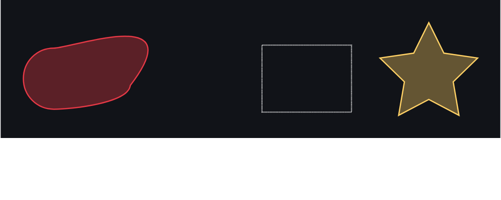

> **Historical.** This is the original proof-of-concept write-up, from before
> the PNG -> mask direction existed. Paths, file sizes and the list of open
> questions have all moved on; see the top-level `README.md` and
> `COORDINATES.md` for the current state. Kept because the reasoning about
> *why* the modules are split the way they are still applies.

# Hippotizer mask tools -- modular C++ proof of concept

Split out of the original single-file `mask2png.cpp` POC into separate,
independently reusable pieces, plus a handful of small diagnostic tools
built on top of them. Everything is plain C++17, **zero external
dependencies** (no tinyxml2, no libpng/zlib, no graphics library) -- just
the standard library, so any piece can be lifted into another codebase
without dragging the rest along.

```
common/
  checksums.h/.cpp        CRC-32 + Adler-32 (shared by the PNG reader/writer)
xml/
  xml_reader.h/.cpp        generic XML -> DOM (XmlElement tree)
  xml_writer.h/.cpp        generic DOM -> XML text
png/
  png_reader.h/.cpp        PNG -> pixel buffer (own DEFLATE inflate + unfiltering)
  png_writer.h/.cpp        pixel buffer -> PNG (own PNG chunks + zlib wrapper)
mask/
  mask_model.h/.cpp        the Masks.xml data model, read/written via xml_reader/xml_writer
  mask_render.h/.cpp       Bezier reconstruction, rasterizing, blur -- mask -> pixels
tools/
  mask2png.cpp             Masks.xml -> PNG (the original POC's CLI, now thin glue)
  svg_export.cpp           Masks.xml -> SVG, in raw coordinate units -- see below
  bounds_report.cpp        prints/CSVs each shape's bounding box vs the assumed canvas
  xml_roundtrip_check.cpp  parse -> write -> reparse -> diff (tests xml_reader+writer)
  png_roundtrip_check.cpp  read -> write -> reread -> diff (tests png_reader+writer)
Makefile
```

## Build

```sh
make            # builds every tool into build/
./build/mask2png Masks.xml out/
```

Each tool also has a one-line usage comment at the top of its `.cpp`.

## Why split it up this way

The original POC was one file because it was answering one question ("can
this be rendered at all"). Splitting it means each piece can be reviewed,
tested, and reused on its own:

* `xml_reader`/`xml_writer` know nothing about masks -- they're a generic
  little XML library. `svg_export.cpp` proves that by using `xml_writer`
  to build an `<svg>` document the exact same way `mask_model.cpp` builds
  a `<Masks>` document.
* `png_reader`/`png_writer` know nothing about masks either -- just PNG.
* `mask_model` is the only place that knows the Masks.xml schema, and
  `mask_render` is the only place that knows how to turn that schema into
  pixels. Anyone implementing this for real can replace `mask_render`
  with Hippotizer's actual renderer without touching the XML or PNG code
  at all.

## What's now verified, that wasn't before

The single-file version was validated once, informally, against a Python/
Skia prototype. Splitting things up made it possible to write small,
targeted regression tests instead:

* **`xml_roundtrip_check`** parses each sample file, writes it back out,
  reparses it, and diffs every numeric field against the original. Both
  sample files round-trip to within `~5e-12` (float text-formatting
  round-off, not a real difference) -- the reader and writer agree with
  each other.
* **`png_roundtrip_check`** is the more important one: it doesn't just
  test our own writer's output. Pointed at a PNG produced by **Python's
  PIL** (real zlib DEFLATE compression, real per-row adaptive filtering --
  nothing like the "stored blocks only" files `png_writer` itself
  produces), it decoded it correctly, re-encoded it, and got back
  byte-identical pixels -- confirmed further by re-opening that
  re-encoded copy in PIL itself and diffing against the PIL original
  (max difference: 0). That means `png_reader`'s hand-written inflate
  (stored + fixed + dynamic Huffman blocks) and unfiltering (all 5 PNG
  filter types) actually work on real-world PNGs, not just files this
  project made -- which matters, because the real use case is reading a
  mask someone hand-painted in Photoshop or GIMP, not just files round-
  tripped through this same code.

## `svg_export` -- a fast way to attack the coordinate-mapping question

The single biggest open question flagged in the original POC was whether
`1 unit = 1 pixel, origin at canvas centre` is even the right coordinate
mapping. `bounds_report` gives you the raw numbers:

```
Mask index=2 name="LiveMask 2"  canvas 1024x768 (assumed range x:[-512,512] y:[-384,384])
  shape[0] 4 nodes  bbox x:[-3241.37,-2017.93] y:[-348.872,351.044]  -> OUTSIDE
  shape[1] 10 nodes  bbox x:[837.903,1954.69] y:[-640.785,421.346]  -> OUTSIDE
```

`svg_export` turns that into a picture: it draws the assumed canvas as a
dashed rectangle and every shape as a filled path, all in the mask's own
raw coordinate units, so opening the SVG in a browser (or Illustrator, with
real rulers) shows exactly how far off the current guess is:



That's the fastest route to actually pinning the mapping down: export an
SVG like this from a mask whose position you can also see in Hippotizer's
own editor, and compare where the shape sits against where it's known to
render.

## Still open (unchanged from the single-file POC)

* **Coordinate -> pixel mapping** -- see above. This is the one that needs
  an answer from inside Hippotizer, not another external guess.
* **`Blur` units** -- used as a Gaussian sigma in pixels; could be a
  percentage or resolution-relative instead.
* **`hvmix`/`hblend`/`vblend`** -- not implemented at all.
* **`Feather*` fields** -- parsed and carried through `mask_model` and
  `writeMasksXml`, but `mask_render` doesn't use them; no sample file has
  a feather path that actually diverges from the main path to test
  against.
* **`infill`** -- ignored; every shape is rendered as a solid fill.
* **Shape/mask compositing mode** -- "lighten" (max) across shapes, a
  guess.

None of these need more guessing from outside -- they're exactly the
constants/behaviours someone with Hippotizer source access can drop into
`mask_render.cpp` once they're known.

## Ideas for further small tools, not built yet

A few more that would plug into this same structure if useful:

* **`mask_diff`** -- render two Masks.xml files (or two masks within one
  file) to buffers and report a pixel-difference summary, for regression-
  testing against Hippotizer's own output once that's obtainable.
* **`svg_to_mask`** (the actual "back again" direction) -- trace a PNG's
  contours (e.g. via a simple marching-squares implementation) into
  polygons, then fit cubic Bezier segments to them and emit a `<Shape>` via
  `mask_model`/`xml_writer`. This is the hard, approximate direction
  discussed earlier -- contour tracing and curve fitting are standard
  techniques, but there's no way to recover the original `Feather*`/`Blur`
  values from a flattened raster, only to approximate a soft edge.
* **`png_to_pgm`** / a tiny ASCII-art dumper -- for eyeballing a small mask
  straight in a terminal without opening an image viewer.
